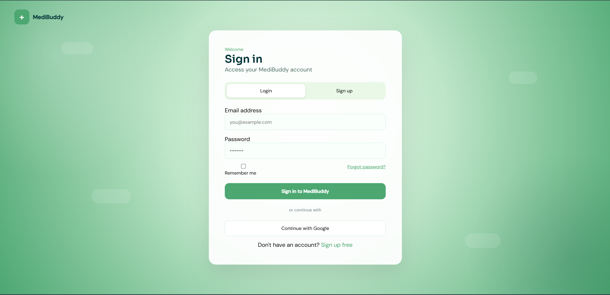
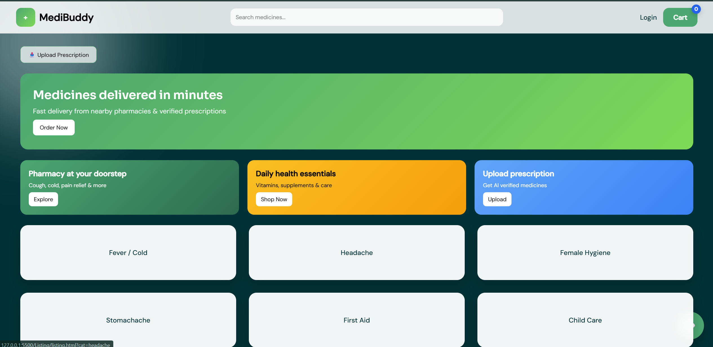
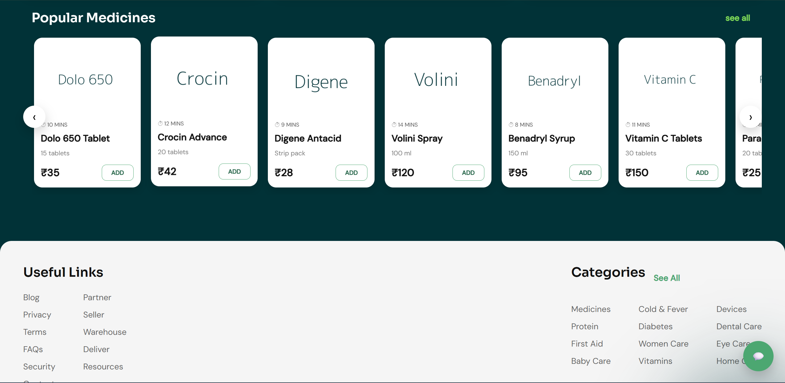
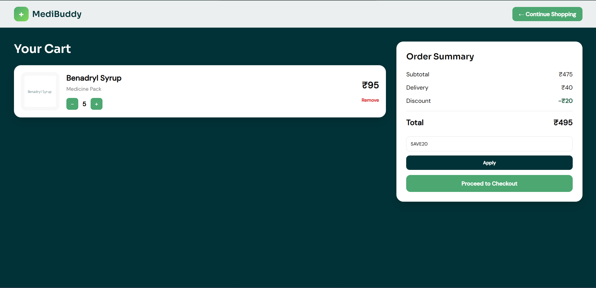
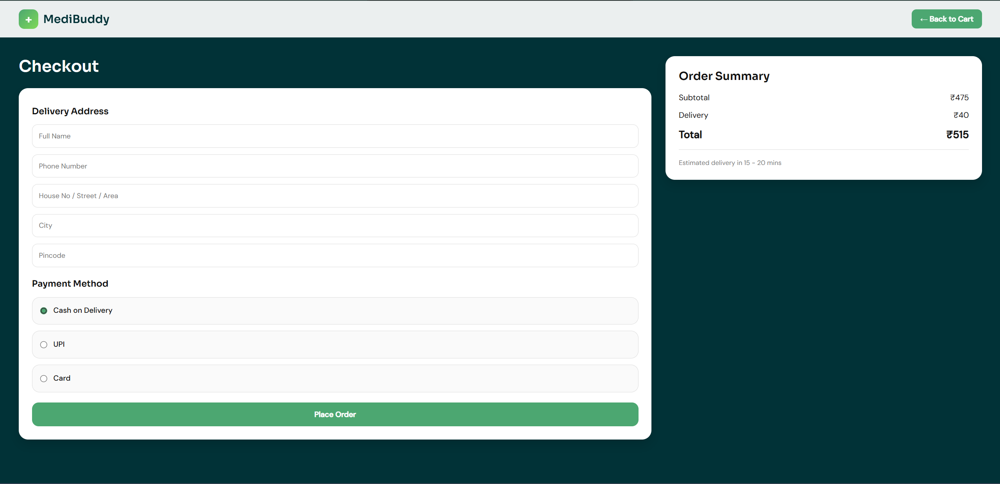
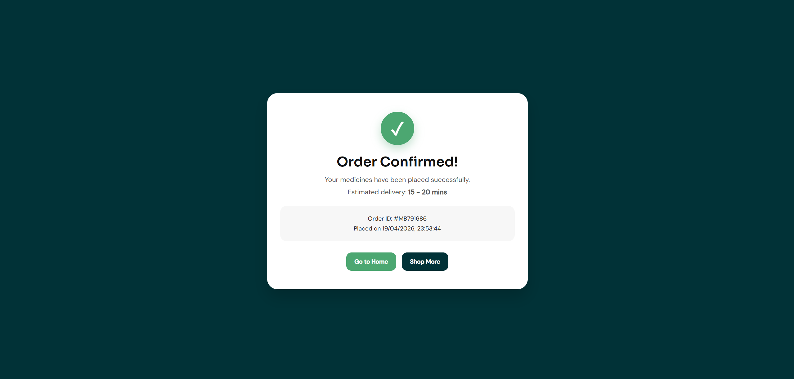

# MediBuddy — Medicine Delivery Web App

A multi-page frontend web application for a fast medicine delivery service. Built with vanilla HTML, CSS, and JavaScript — no frameworks, no backend.

**Live Demo**: [https://github.com/pratyush262005/Medibuddy.git](#) 

---

## Screenshots






## Features

- **Homepage** — Hero banner, category grid, horizontally scrollable product carousel, search bar
- **Product Listing** — Filter by category, live search, 35+ medicines with discount badges
- **Cart** — Add/remove items, quantity control, coupon codes (MEDI10, SAVE20), order summary
- **Checkout** — Delivery address form, payment method selection (COD / UPI / Card), order placement
- **Order Success Page** — Confirmation with order ID and estimated delivery time
- **Login / Sign Up** — Tab-based auth form with validation, Google login (coming soon)

---

## Tech Stack

| Technology | Usage |
|---|---|
| HTML5 | Page structure & semantics |
| CSS3 | Styling, animations, responsive design |
| Vanilla JavaScript | DOM manipulation, cart logic, routing |
| localStorage | Cart persistence, order saving |
| Google Fonts | Sora + DM Sans typography |

---

## Project Structure

```
medibuddy-app/
│
├── Homepage/
│   ├── home.html
│   └── home.css
│
├── listing/
│   ├── listing.html
│   ├── listing.css
│   └── listing.js
│
├── Cart/
│   ├── cart.html
│   ├── cart.css
│   └── cart.js
│
├── checkout/
│   ├── checkout.html
│   ├── checkout.css
│   └── checkout.js
│
├── Successpage/
│   ├── success.html
│   ├── success.css
│   └── success.js
│
└── LoginPage/
    ├── login.html
    ├── login.css
    └── script.js
```

---

## Getting Started

No installation needed. Just open the project locally:

1. Clone the repository:
   ```bash
   git clone https://github.com/your-username/medibuddy-app.git
   ```

2. Open `Homepage/home.html` in your browser.

That's it — no build steps, no dependencies!

---

## Demo Coupon Codes

Try these on the Cart page:

| Code | Discount |
|---|---|
| `MEDI10` | ₹10 off |
| `SAVE20` | ₹20 off |

---

## Pages Overview

| Page | File | Description |
|---|---|---|
| Home | `Homepage/home.html` | Landing page with categories and products |
| Listing | `listing/listing.html` | Browse and filter all medicines |
| Cart | `Cart/cart.html` | Review cart and apply coupons |
| Checkout | `checkout/checkout.html` | Enter delivery details and place order |
| Success | `Successpage/success.html` | Order confirmation |
| Login | `LoginPage/login.html` | Login and Sign Up |

---

## Future Improvements

- [ ] Connect to a real backend (Node.js / Firebase)
- [ ] User authentication with JWT
- [ ] Order history page
- [ ] Real product images via API
- [ ] Working prescription upload
- [ ] UPI / Card payment gateway integration
- [ ] Chatbot assistant

---

## Author

**Your Name**
- GitHub: https://github.com/pratyush262005
- LinkedIn: https://www.linkedin.com/in/pratyush-sharma-91826533a/

---

## License

This project is open source and available under the [MIT License](LICENSE).
